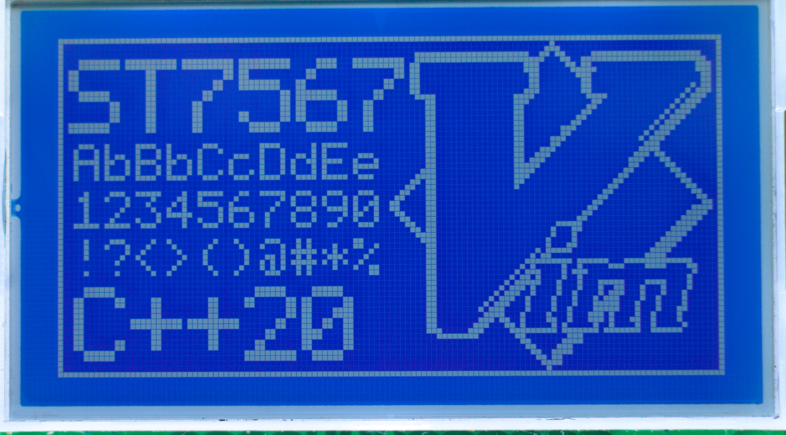

# About the IC
ST7567 is a monochrome graphic controller designed for STN/FSTN dot-matrix LCDs. Integrates display RAM (65 × 132 bits), contrast control, segment/common drivers, oscillator, and LCD voltage generation circuit.
Supported interfaces: 4-wire SPI, 8080, and 6800 parralel

More details in the [datasheet](https://www.laskakit.cz/user/related_files/st7565-datasheet.pdf)

## Preview
  

### Driver features
- Portable to any MCU platform
- Drawing any pixel in the 128x64 buffer
- Bitmap fonts 5x8, 10x16 and custom support
- Bitmap images (Vim logo shown in the preview)
- Setting display properties like contrast

## Getting started
### Premade example code
1. `git clone` this repository
2. Choose your preferred MCU in the [platform](platform/) directory

### As a static library
#### Installation (CMake)
1. `git clone` this repo inside your project

2. Add `add_subdirectory(ST7567-RPi-Pico-driver)` to your CMakeLists.txt 

3. Add `ST7567` keyword to your `target_link_libraries`
